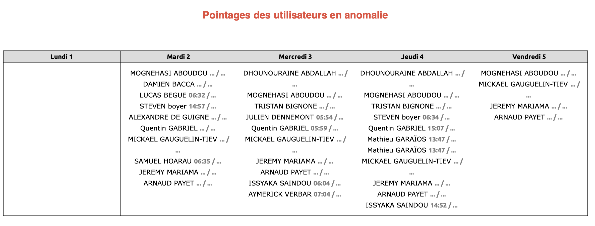

Une anomalie est un pointage qui ne respecte pas les règles de pointage. Il peut s'agir d'un pointage manquant, d'un pointage avec une heure d'entrée ou de sortie incorrecte, ou d'un pointage avec une heure d'entrée ou de sortie manquante.

Chaque jour, un mail récapitulatif est envoyé à la partie technique avec le détail des anomalies de la semaine.

