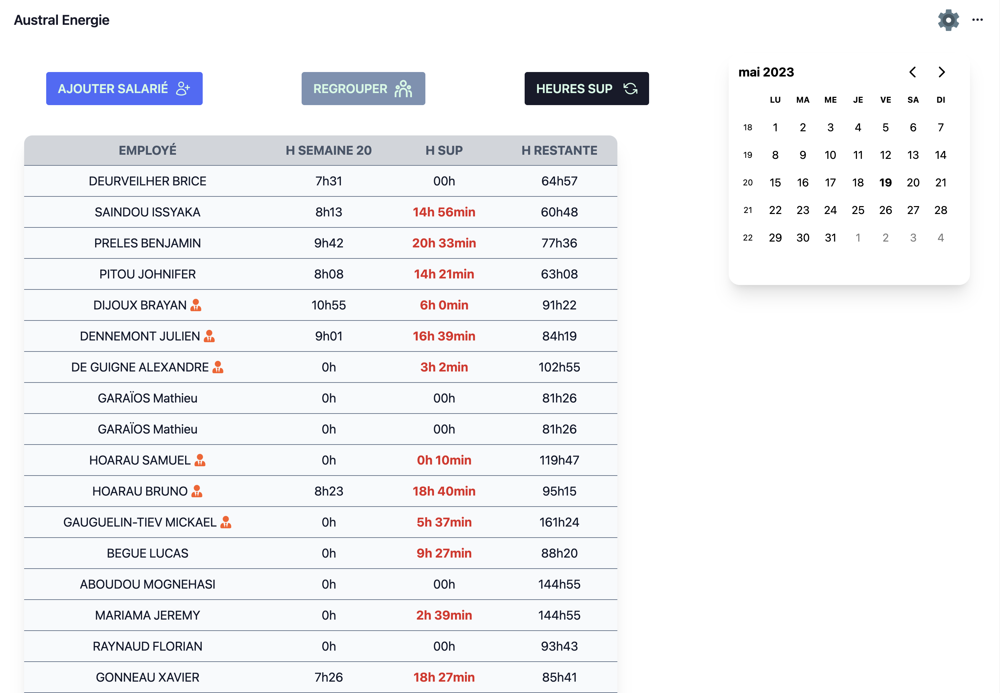

Les heures supplémentaires sont calculées automatiquement en fonction des pointages d'entrée et de sortie des employés. Les heures supplémentaires sont calculées en fonction des seuils horaires définis dans les paramètres de l'application.

Pour afficher les heures supplémentaires de chaque employé, cliquez sur le bouton **Liste Salariés** en haut à droite du tableau.

Le tableau changera de vue et affichera les heures supplémentaires de chaque employé.

